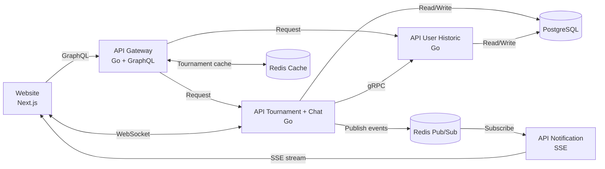

# Site d'organisation de tournoi esport

Projet par Axel Senecal.

## TODO List

- [x] Site web
- [x] API Gateway
- [x] Message broker
- [x] Base de données
- [x] Service tournoi & chat
- [x] Service notification
- [x] Service historique utilisateur
- [x] Dockeriser l'ensemble du projet

## Services

### Site web

Site web en NextJS, servira de front end.  
Communique directement avec l'API Gateway.  
Implémente des WebSocket pour un service de chat dans les tournois.

### API Gateway

API en Golang, servira de gateway entre le site web et les micro services.  
Utilisera du GraphQL avec un système d'authentification.

### Message broker

Avoir de la programmation évènementielle entre les micro services.  
Utilisera Redis Pub/Sub.

### Base de données

Base de données PostgreSQL pour stocker les données des tournois, utilisateurs, inscriptions, etc.  
Puis un cache Redis pour les statistiques.

### Service tournoi & chat

Micro services en Golang, API avec Fiber.  
Depuis un compte organisateur, permettre la création et la gestion des tournois, ainsi que la visualisation du dashboard.  
Depuis un compte utilisateur, permettre l'inscription aux tournois &rarr; envoie un évènement aux services profil utilisateur et notification.  
Suivre les places restantes d'un tournoi en temps réel.  
Utilisation de WebSocket pour avoir un chat dans chaque tournoi.

### Service notification

Micro services en Golang, utilisera un server-sent events.
Reçoit un évènement du service tournoi &rarr; envoie des notifications aux joueurs par rapport aux tournois inscrits.  

### Service historique utilisateur

Historique des tournois inscrits avec les résultats pour ceux terminés.  
Reçoit un évènement du service tournoi.

### Dockeriser l'ensemble du projet

L'ensemble du projet doit être exécutable via un docker compose.

## Architecture

## Contraintes techniques obligatoires

- [x] API Gateway en GraphQL
- [x] Communication inter-service via gRPC &rarr; tournoi / utilisateur
- [x] Redis cache &rarr; gateway (tournois)
- [x] Redis Pub/Sub &rarr; tournoi vers notification
- [x] WebSocket &rarr; chat tournoi
- [x] SSE &rarr; notification vers website
- [x] Frontend moderne &rarr; NextJS
- [X] Dockerisation complète